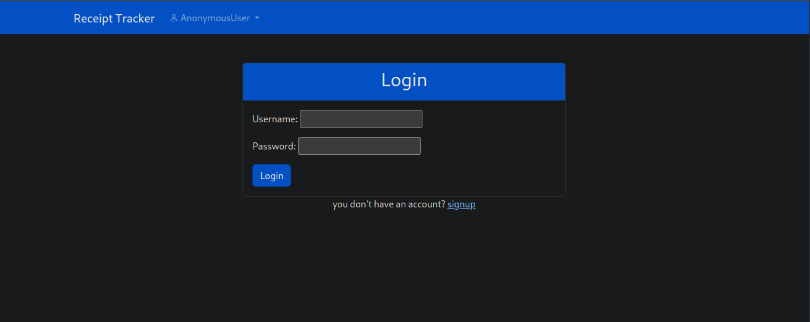
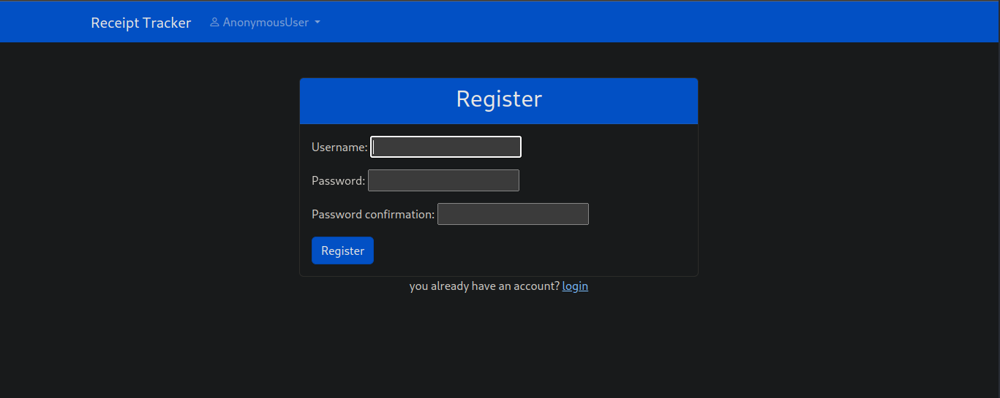
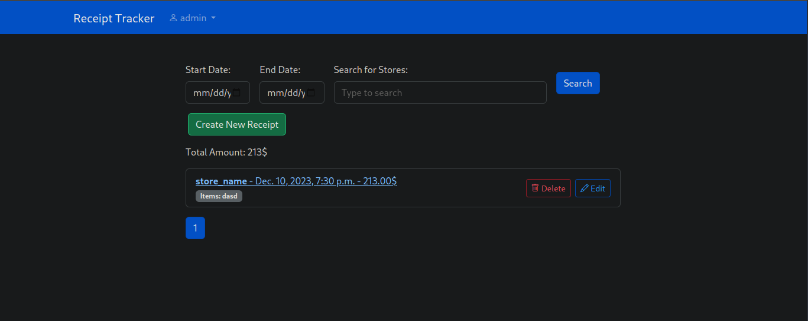
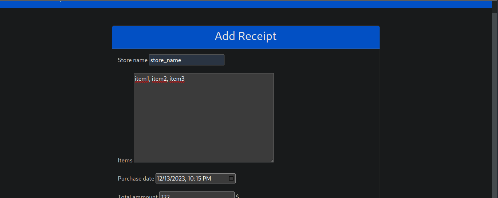
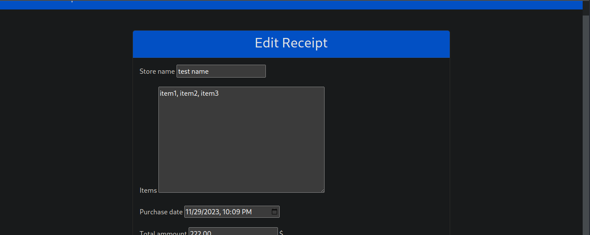
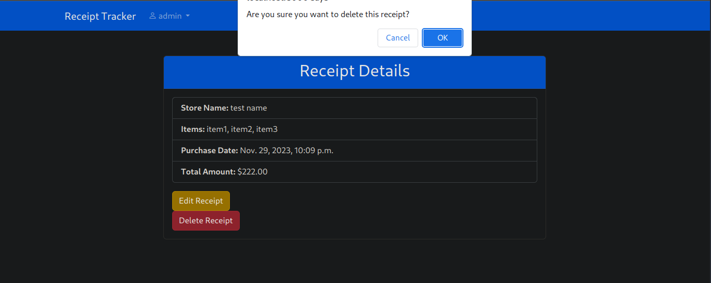

# Receipt Manager 

A straightforward and simple Receipt Manager for effortless tracking and organization of your receipts. Simplify your expense management with easy manual entry and categorization.

## Setup
1. first create clone the repository

```sh
$ git clone https://github.com/gocardless/sample-django-app.git
$ cd receipt_manager
```
2. Install dependencies
first ensure that you have a virtual environment set uo before installing
```sh
$python -m venv env
```
then you can activate the virtual environment:
- on windows:
```sh
$ .\env\Scripts\activate
```
- on Linux:
```sh
$ ./env/bin/activate
```
now install the dependencies
```sh
(env)$ pip install -r requirements.txt
```
3. Once pip has finished downloading the dependencies, run the server

```sh
(env)$ cd receipt_manager
(env)$ python manage.py runserver
```

4. Navigate to `http://127.0.0.1:8000/`


## Walkthrough

### 1. Creating an account

after navigating to `http://127.0.0.1:8000/` you'll be faced with a login page, instead click on signup button this will take you to the registration page, fill your information and then click on signup



### 2. Creating a receipt 
after siginup you'll be redirected to your receipts list page where you'll see all your receipts, to create a receipt click on create a new receipt, after that you'll be redirected to the this form, all you have to do is to fill the receipt information(store name, items as a list separated by comma, purchase date and time, the total ammount) and then click on save.



### 3. Editing a receipt
to edit a receipt navigate to the target receipt and click on the edit button it will take you to a form to edit the receipt once you finish click save


### 4. Delete a receipt 
to delete a receipt click on the delete button


## Tests

to run the tests, `cd` into the root directory where `manage.py` is:
```sh
(env)$ python manage.py test receipts.tests
```


